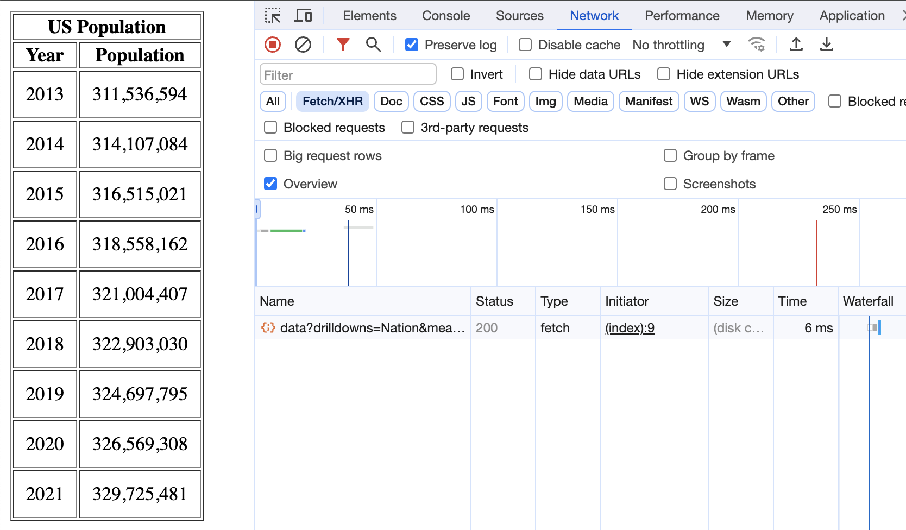

# CS3980_HW2

My file structure looks like:

`(venv) (base) Ilyas-MacBook-Pro:CS3980_HW2 ilyat$ ls`
`README.md       __pycache__     index.html      main.py         venv`

The final product looks like:

I achieved this in the following way:

My backend is in python and uses fastAPI and uvicorn to expose it to a port. The backend simply serves up index.html to port 8000. The index.html contains a script which does a fetch to the api to grab the data, you can see this on the network tab. It then sorts the data by year and formats it. Finally it populates a table using a loop. Pretty straightforward. I also use a virtual env but thats about it, any details you can see in the code, the run command is:

`uvicorn main:app --port 8000 --reload`